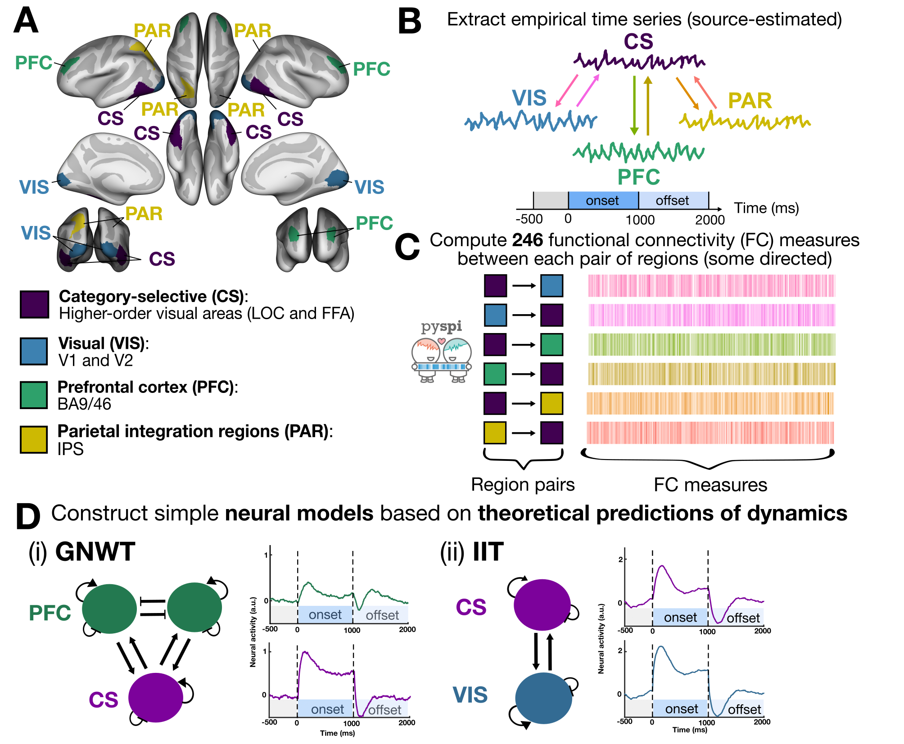
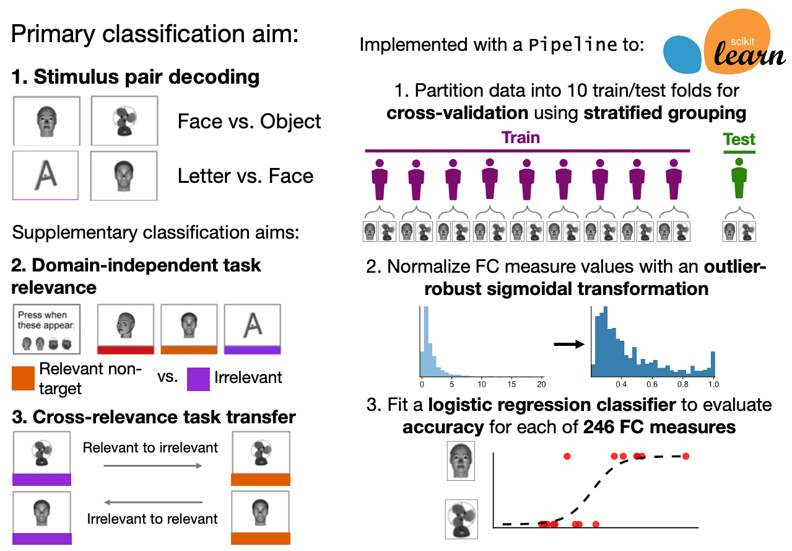

# A data-driven approach to identifying and evaluating connectivity-based neural correlates of consciousness

This repository contains all code needed to reproduce analyses and visuals presented in our preprint, [A data-driven approach to identifying and evaluating connectivity-based neural correlates of consciousness]().



# Data availability

All magnetoencephalography (MEG) data used in this study is openly accessible upon registration with the [COGITATE Consortium](https://cogitate-data.ae.mpg.de/).

Specifically, the MEG data analyzed in this study is from the following reference:

Liu, L., Ferrante, O., Ghafari, T., Hetenyi, D., Yang, S., Hirschhorn, R., Gorska-Klimowska, U., Bonacchi, N., Brown, T., Das, D., Kahraman, K.S.T.,  Sripad, P., Taheriyan, F., Melloni, L., Mudrik, L., Pitts, M., Jensen, O., Luo, H. (2024). Cogitate M-EEG Data [Dataset]. Max Planck Institute for Empirical Aesthetics. https://doi.org/10.17617/1.WQA3-WK71


❗ All **intermediate data files** needed to replicate analysis and visuals in this project, including the preprocessed MEG time series from relevant brain regions, are included in the [`data/`](https://github.com/anniegbryant/MEG_functional_connectivity/tree/main/data) folder.

# Usage

## Installation

First, clone this repository to your local machine:

```bash
git clone https://github.com/anniegbryant/MEG_functional_connectivity.git
```

This project employs a mixture of: 
* python (v 3.9.17) for [MEG preprocessing](https://github.com/anniegbryant/MEG_functional_connectivity/tree/main/MEG_preprocessing), functional connectivity measure computation, and neural mass modeling
* R (v 4.4.2) for data visualization

We provide preprocessed MEG time series such that preprocessing functionality is not required; however, for users interested in fully reproducing our pipeline, the following is needed:
* Unix-like system (and/or Mac OS) to execute bash scripts 
* [FreeSurfer](https://surfer.nmr.mgh.harvard.edu/) installation and license

We recommend that users create a conda environment for this project, which can be accomplished as follows:

```bash
conda create -n MEG_functional_connectivity python=3.9.21
conda activate MEG_functional_connectivity
```

From this conda environment, install the required Python packages:

```bash
pip install -r requirements.txt
```

R packages required for data visualization can be installed from the `install_R_packages_for_visualization.R` script as follows:

```bash
Rscript install_R_packages_for_visualization.R
```
All required data is provided to plug-and-play with the Jupyter notebooks in [data_visualization/](https://github.com/DynamicsAndNeuralSystems/OverlappingCommunityDetection_HCP/tree/main/data_visualization).

## MEG Preprocessing

MEG volumes were preprocessed according to the MNE-Python workflow, using methods developed and employed by the COGITATE Consortium [[1](https://github.com/Cogitate-consortium/cogitate-msp1)], [[2](https://doi.org/10.1016/j.neuroimage.2022.119047)].

The main steps called in our pipeline can be found in [`MEG_preprocessing/MEG_preprocessing_driver_script.sh`](https://github.com/anniegbryant/MEG_functional_connectivity/blob/main/MEG_preprocessing/MEG_preprocessing_driver_script.sh), which in turn references files from the [`cogitate-msp1`]((https://github.com/Cogitate-consortium/cogitate-msp1)) repository compiled by the COGITATE Consortium and included as a submodule here.
Running this script generates the source-localized MEG time series that we included in [`data/empirical/MEG_time_series`](https://github.com/anniegbryant/MEG_functional_connectivity/tree/main/data/empirical/MEG_time_series).

Specifically, we've extracted time series from four key brain areas hypothesized to underlie conscious perception in Integrated Information Theory and/or Global Neuronal Workspace Theory, as depicted in the above figure: 

1. Category-selective (CS): Lateral occipital cortex and fusiform face area
2. Primary visual cortex (VIS): V1 and V2
3. Prefrontal cortex (PFC): BA9 and BA46
4. Parietal integration regions (PAR): Intraparietal sulcus

## Functional connectivity measurements

We employed the highly comparative [`pyspi`](https://github.com/DynamicsAndNeuralSystems/pyspi) library to compute a total of 262 functional connectivity (FC) measures, of which **246** passed quality control checks for downstream analysis here.
All functional connectivity results are included in [`data/empirical/functional_connectivity_measures`](https://github.com/anniegbryant/MEG_functional_connectivity/tree/main/data/empirical/functional_connectivity_measures) with one CSV per participant (n.b., all measures were computed for averaged epochs per participant).

All code needed to reproduce these measure values from the MEG time series is included in [`functional_connectivity_analysis/`](https://github.com/anniegbryant/MEG_functional_connectivity/tree/main/functional_connectivity_analysis).
Specifically, you can run the driver (bash) script [`call_feature_extraction.sh`](https://github.com/anniegbryant/MEG_functional_connectivity/blob/main/functional_connectivity_analysis/call_feature_extraction.sh) to iterate over all participants in the dataset.
For each participant, this will call the Python script [`run_pyspi_for_subject_averaged_epochs.py`](https://github.com/anniegbryant/MEG_functional_connectivity/blob/main/functional_connectivity_analysis/run_pyspi_for_subject_averaged_epochs.py), which computes the 246 FC measures between theory-relevant regions for each stimulus presentation period (onset vs. offset), stimulus type (face, object, letter, or false font), and task relevance setting (relevant non-target versus irrelevant).
Running this script will yield the FC measure result files (one per participant) that are included in [`data/empirical/functional_connectivity_measures`](https://github.com/anniegbryant/MEG_functional_connectivity/tree/main/data/empirical/functional_connectivity_measures).

## Stimulus decoding classification analysis

To evaluate how well each FC measure distinguished between visual stimuli across region--region pairs, we employed logistic regression classifiers for each binary stimulus pair (e.g., 'face' versus 'letter').
We evaluated generalizability of a given FC measure and stimulus context using a 10-fold cross-validation strategy with stratification, such that each 90% training subset included time series from 90% of participants, while each 10% test subset included the remaining 10% of participants.



All code to reproduce our classification analysis is included in [`classification/`](https://github.com/anniegbryant/MEG_functional_connectivity/tree/main/classification).
Specifically, you can run the driver (bash) script [`call_classification.sh`](https://github.com/anniegbryant/MEG_functional_connectivity/blob/main/classification/call_classification.sh) which calls the main Python script [`fit_pyspi_classifiers.py`](https://github.com/anniegbryant/MEG_functional_connectivity/blob/main/classification/fit_pyspi_classifiers.py) with some key input parameters.
In turn, [`fit_pyspi_classifiers.py`](https://github.com/anniegbryant/MEG_functional_connectivity/blob/main/classification/fit_pyspi_classifiers.py) will iterate over each FC measure, stimulus pair, stimulus presentation period, and/or relevance setting to perform the corresponding classification type (the three types are depicted in the above image).
Results from the three classification analyses are included in [`data/empirical/stimulus_decoding_classification`](https://github.com/anniegbryant/MEG_functional_connectivity/tree/main/data/empirical/stimulus_decoding_classification).

## Neural mass modeling

For Chris to fill in an overview of the implementation files, how to run them, and where the output can be found

## Data visualization

All figures were created through a combination of programmatic plotting and arrangement in Inkscape.
Individual figure components can be reproduced through interactive Jupyter notebooks found in [`data_visualization/`](https://github.com/anniegbryant/MEG_functional_connectivity/tree/main/data_visualization).
Many of the figures in the main text involving stimulus decoding from empirical MEG data were generated from the notebook [`data_visualization/classification_analysis_visualization.ipynb`](https://github.com/anniegbryant/MEG_functional_connectivity/blob/main/data_visualization/classification_analysis_visualization.ipynb).
Barycenter-specific analyses on both empirical and simulated data can be found in [`data_visualization/barycenter_empirical_analysis.ipynb`](https://github.com/anniegbryant/MEG_functional_connectivity/blob/main/data_visualization/barycenter_empirical_analysis.ipynb).
Methods robustness checks (for MEG polarity and aggregating) can be found in [`data_visualization/MEG_dipole_riobustness.ipynb`](https://github.com/anniegbryant/MEG_functional_connectivity/blob/main/data_visualization/MEG_dipole_robustness.ipynb).